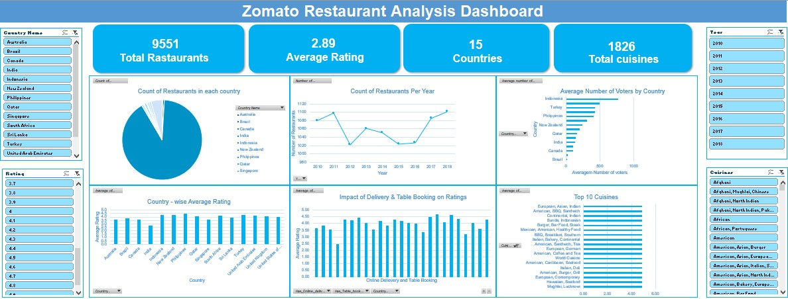

## 📊 Dashboard Preview

<p align="center">
  
</p>

<p align="center">
  <b>Zomato Restaurant Expansion Analysis Dashboard</b>
</p>

---
# 🍽️ Zomato Restaurant Expansion Analysis

## 📖 Project Overview

This project presents a comprehensive analysis of Zomato restaurant data to identify potential opportunities for restaurant expansion. The analysis focuses on understanding customer preferences, restaurant performance, cuisine popularity, and market trends through data-driven insights and interactive dashboard visualizations.

The objective is to support strategic business decisions by identifying high-potential locations and customer-driven market opportunities.

---

## 🎯 Business Objective

Restaurant businesses often face challenges in selecting profitable locations and understanding customer preferences before expansion. This project aims to:

- Identify cities with strong restaurant demand.
- Analyze customer ratings and engagement.
- Evaluate popular cuisines across different markets.
- Understand pricing trends and customer satisfaction.
- Support data-driven expansion strategies.

---

## 🛠️ Tools & Technologies

- Microsoft Excel
- Data Cleaning & Transformation
- Pivot Tables
- Pivot Charts
- Dashboard Design
- KPI Analysis
- Business Intelligence Reporting

---

## 📊 Dashboard Preview


---

## 📌 Key Performance Indicators (KPIs)

- Total Restaurants
- Average Rating
- Average Cost for Two
- Top Cities by Restaurant Count
- Most Popular Cuisines
- Customer Engagement Analysis
- Restaurant Distribution Analysis

---

## 🔍 Analysis Performed

### Data Cleaning
- Removed inconsistencies and duplicate records.
- Standardized categorical values.
- Validated and prepared data for analysis.

### Exploratory Data Analysis
- Restaurant distribution by city.
- Cuisine popularity analysis.
- Customer rating trends.
- Cost and affordability analysis.
- Market demand evaluation.

### Dashboard Development
An interactive Excel dashboard was created to provide stakeholders with a clear view of key metrics and business insights.

---

## 💡 Key Insights

- Certain cities dominate restaurant concentration and customer engagement.
- Popular cuisines consistently attract higher customer ratings.
- Pricing patterns influence customer satisfaction across markets.
- Several emerging markets show strong potential for restaurant expansion.
- Data-driven location selection can significantly improve expansion success.

---

## 📂 Repository Structure

```text
Zomato-Restaurant-Expansion-Analysis
│
├── Dashboard_preview.jpg
├── README.md
├── Zomato_Restaurant_Expansion_Analysis.xlsx
├── Zomato_Restaurant_Expansion_Analysis.pptx
└── Project_Report.docx
```

---

## 🚀 Business Recommendations

- Prioritize expansion in high-demand cities.
- Focus on highly rated and popular cuisines.
- Optimize pricing strategies according to local market preferences.
- Use customer feedback and ratings to improve service quality.
- Continuously monitor market trends before expansion decisions.

---

## 👨‍💻 Author

**Jaiprakash Sharma**

Aspiring Data Analyst | Excel | SQL | Power BI | Python

🔗 GitHub: https://github.com/jpSharma123-sudo

---

## 📄 License

This project is created for educational, learning, and portfolio purposes.
